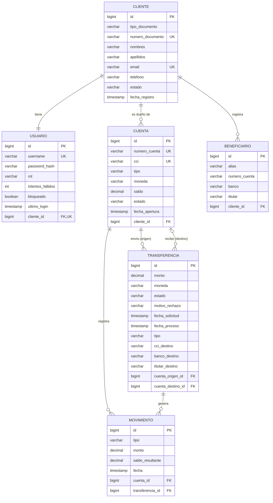

# Mini-Bank-App

## ¿Qué es MiniBank?

MiniBank es un banco digital pequeño. Permite que una persona se registre como cliente, abra sus cuentas y maneje su dinero desde la aplicación, sin ir a una agencia.

Con MiniBank un cliente puede:

- **Registrarse** con su documento de identidad, nombre, correo y teléfono.
- **Ingresar a la app** con su usuario y contraseña. Si se equivoca varias veces seguidas, su acceso se bloquea para protegerlo.
- **Tener una o varias cuentas** en soles o en dólares, cada una con su número de cuenta y su CCI.
- **Transferir dinero** a otras cuentas de MiniBank o de otros bancos.
- **Guardar beneficiarios**, es decir, las cuentas a las que envía dinero seguido, para no escribir los datos cada vez.
- **Ver sus movimientos**: cada ingreso y cada salida de dinero queda registrado con el saldo que quedó después.

El proyecto está hecho con **Spring Boot** y sigue una **arquitectura hexagonal**.

## Modelo de datos (ERD)

El script de la base de datos está en [init.sql](init.sql).

## Casos de uso

### Caso de uso 1: Enviar dinero a otra persona

**Quién lo usa:** un cliente de MiniBank.

**Qué quiere lograr:** mandar dinero desde una de sus cuentas a la cuenta de otra persona, sea de MiniBank o de otro banco.

**Cómo sucede:**

1. El cliente entra a la app con su usuario y contraseña.
2. Elige la cuenta desde la que va a enviar el dinero.
3. Indica a quién le envía: escoge un beneficiario que ya tiene guardado o escribe los datos de la cuenta destino.
4. Escribe cuánto quiere enviar.
5. La app le muestra un resumen de la solicitud para valdiación.
6. El cliente confirma.
7. Se le descuenta dinero.
8. El envío aparece en su lista de movimientos.

**Qué puede salir mal:**

- **No tiene suficiente dinero:** la app le avisa que su saldo no alcanza y no envía nada.
- **La cuenta destino no existe o está cerrada:** la transferencia se rechaza y se le explica el motivo.
- **Las monedas no coinciden**: la app se lo indica antes de confirmar.

---

### Caso de uso 2: Guardar a alguien como beneficiario

**Quién lo usa:** un cliente de MiniBank.

**Qué quiere lograr:** guardar los datos de una persona a la que le envía dinero seguido para no escribirlos cada vez.

**Cómo sucede:**

1. El cliente entra a la app.
2. Va a la sección "Mis beneficiarios" y elige "Agregar beneficiario".
3. Escribe los datos de la otra persona: número de cuenta, banco y nombre del titular.
4. Le pone un nombre corto para reconocerlo fácil, por ejemplo "Mamá" o "Alquiler".
5. Confirma y el beneficiario queda guardado.
6. La próxima vez que quiera transferir, solo lo escoge de su lista.

**Qué puede salir mal:**

- **Faltan datos o están mal escritos:** la app le dice qué debe corregir antes de guardar.
- **Ya tiene guardada esa misma cuenta:** la app le avisa que ese beneficiario ya existe.
- **Repite un nombre corto que ya usó:** la app le pide que ponga otro para no confundirse.
